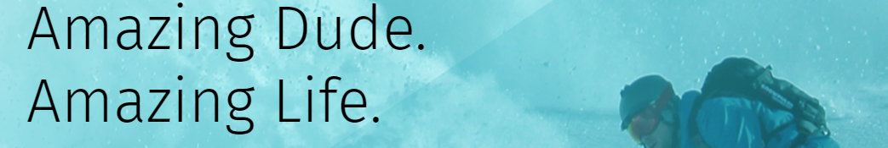

<h1 align="center">Amazing Life</h1>

<h2>Description</h2>

The project was created from a PSD layout, taken in the public domain for educational and practical purposes.  
Used for illustrative purposes only.

<h3>Цель</h3>

Gaining practical skills with a <b> grid layout</b>.

<h3>Technologies</h3>

- CSS

- JavaScript

<h2>Project settings</h2>

First you need to clone the project to your device, then run the file <b>index.html</b>

<h3>
Further project</h3>
• Not planned
